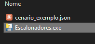
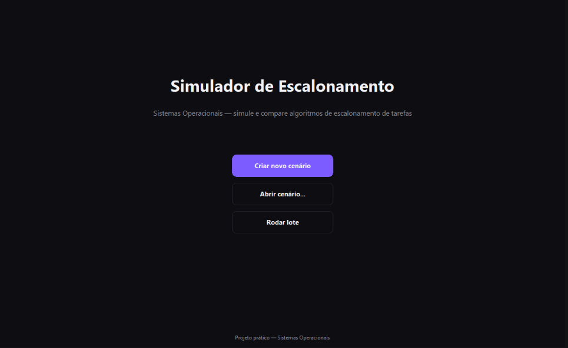
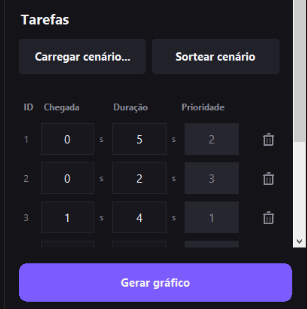
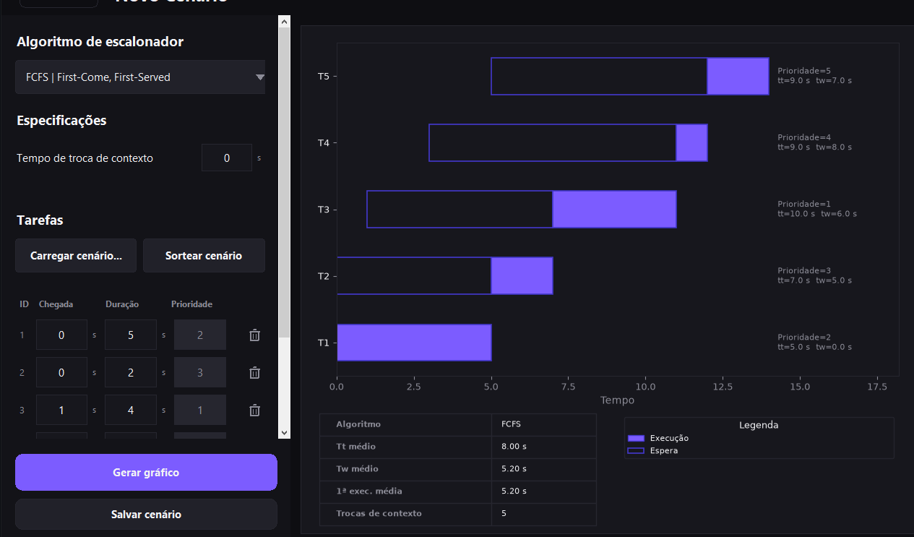

# Tutorial de Execução

Como colocar o Simulador de Escalonamento para funcionar.

## 1. Pré-requisitos

- Sistema operacional: Windows 10 ou superior, 64 bits.

## 2. Abertura

1. Baixe `Escalonadores.exe` clicando [aqui](https://github.com/andre-monar/escalonadores-python/releases/download/v1.0/Escalonadores.exe).
2. (OPCIONAL) Baixe `cenario_exemplo.json` clicando [aqui](https://github.com/andre-monar/escalonadores-python/releases/download/v1.0/cenario_exemplo.json)
3. Dê dois cliques em `Escalonadores.exe`.

> O Windows pode exibir um aviso do SmartScreen ("O Windows protegeu o computador"), porque o executável não é assinado digitalmente. Clique em "Mais informações" e depois em "Executar assim mesmo".

## 3. Primeira tela

Ao abrir, o programa mostra a tela inicial, com três botões:

- **Criar novo cenário** — abre a tela de montagem de um cenário do zero.
- **Abrir cenário...** — carrega um cenário salvo anteriormente em um arquivo `.json`.
- **Rodar lote** — sorteia 50 cenários aleatórios, roda os seis algoritmos em cada um e mostra a média de cada algoritmo numa tabela.

## 4. Execução mínima

A sequência mais curta que produz um resultado na tela:

1. Na tela inicial, clique em **Criar novo cenário**.
2. Na tela que abre, na seção "Tarefas", clique em **Sortear cenário** — o programa preenche automaticamente 5 tarefas com valores aleatórios (chegada, duração e prioridade).
> **Dica:** Você pode usar o cenário padrão do exemplo ao apertar em `Carregar cenário...` e selecionar o `cenario_exemplo.json`. 
3. Clique no botão roxo **Gerar gráfico**, no canto inferior da barra lateral.

## 5. Resultado esperado

Depois de clicar em "Gerar gráfico", o painel à direita passa a mostrar o diagrama de tempo do cenário sorteado: uma barra horizontal por tarefa (T1 a T5), a legenda embaixo à direita e a tabela de resumo (algoritmo, Tt médio, Tw médio, 1ª execução média e trocas de contexto) embaixo à esquerda.

> Resultado esperado com o algoritmo `FCFS` no cenário exemplo:

## 6. Possíveis problemas

- **A janela não abre, ou fecha sozinha logo depois de abrir**: geralmente é o SmartScreen do Windows bloqueando silenciosamente, ou um antivírus colocando o executável em quarentena por ele não ser assinado digitalmente. Verifique a quarentena do antivírus e libere o arquivo, se for o caso.

### Continue o tutorial em [Tutorial de uso](./tutorial_uso.md)!