# Tutorial de Uso

Como operar o Simulador de Escalonamento em cada uma de suas funções. Este tutorial assume que o programa já está aberto na tela inicial (veja o [tutorial de execução](./tutorial_execucao.md) se ainda não chegou até aqui).

## 1. Criar novo cenário

Na tela inicial, clique em **Criar novo cenário**.

## 2. Escolher o algoritmo

O dropdown **Algoritmo de escalonador**, logo abaixo do título "Novo Cenário", lista os seis algoritmos:

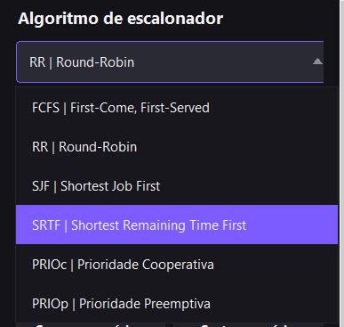

Alguns algoritmos adicionam mais especificações na tela, como:

- **RR** libera o campo **Quantum**
- **PRIOc** libera o campo de prioridade nas tarefas e mostra **Fator de envelhecimento (α)** nas Especificações — o quanto a prioridade de uma tarefa parada sobe a cada segundo de espera, evitando inanição. `α = 0` equivale a rodar sem envelhecimento.
- **PRIOp** também libera a prioridade e mostra o dropdown **Protocolo de correção** (`Nenhum`, `Herança` ou `Teto`), além de abrir a seção **Recursos** 

## 3. Definir especificações

No topo da barra lateral, a seção **Especificações** traz:

- **Tempo de troca de contexto** (`ttc`) — sempre visível, em segundos.

Campos que só aparecem dependendo do algoritmo selecionado:
- **Quantum** — só aparece quando o algoritmo escolhido é `RR | Round-Robin`.
- **Fator de envelhecimento (α)** — só aparece com `PRIOc | Prioridade Cooperativa`. Com `α = 0` (padrão), o comportamento é o mesmo de rodar sem envelhecimento.
- **Protocolo de correção** — só aparece com `PRIOp | Prioridade Preemptiva`, com as opções `Nenhum`, `Herança` e `Teto`
> Se você informar um quantum menor ou igual ao tempo de troca de contexto e clicar em **Gerar gráfico**, o programa recusa a simulação e mostra um erro.

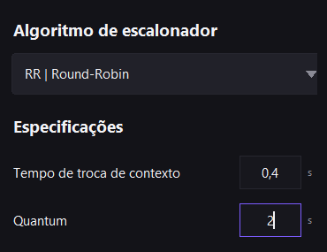

## 4. Criando tarefas

### 4a. Sorteando

Clique em **Sortear cenário**, ao lado de **Carregar cenário...**, no topo da seção Tarefas. O programa descarta as tarefas atuais e sorteia 5 novas:

- A primeira sempre chega em `0`.
- As demais chegam entre `0` e `9`.
- Todas recebem duração entre `0` e `9` e prioridade entre `1` e `5`.

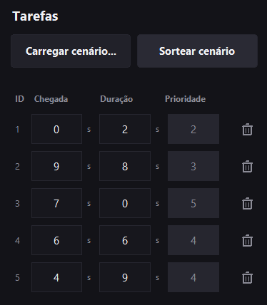

### 4b. Manualmente

Você pode manipular as tarefas no campo tarefas. Clique em **+ Adicionar tarefa** para incluir mais linhas, ou no ícone de lixeira à direita de uma linha para removê-la. O número em cada linha (T1, T2, ...) é sempre a posição da tarefa na lista — remover uma linha renumera as seguintes.

Cada linha representa uma tarefa, com três campos:

- **Chegada** — instante em que a tarefa surge (em segundos).
- **Duração** — tempo de processamento que ela demanda, `tp` (em segundos).
- **Prioridade** — só fica editável quando o algoritmo escolhido usa prioridade; nos demais, fica travada em 1.

> O programa bloqueia inputs inválidos; trata decimais sem valor depois ou antes da vírgula automaticamente, e também preenche automaticamente campos vazios com os placeholders.

## 5. Ler os resultados

Depois de clicar em **Gerar gráfico**, o painel direito mostra o diagrama de tempo, uma linha por tarefa (T1, T2, ...):

- **Barra roxa cheia** — tarefa execução
- **Barra laranja** — troca de contexto
- **Barra vazada (só contorno)** — tarefa em espera
- **Hachura `///`** — tarefa bloqueada (recurso sendo usado)
- **Faixa colorida no meio da barra** — recurso sendo usado (a cor é a mesma do recurso)
- **Linha tracejada vertical** — marca uma execução que foi interrompida por preempção e vai continuar depois
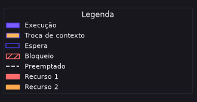

À direita de cada barra aparece `Prioridade=<valor>` e, embaixo, `tt=<valor> s  tw=<valor> s` (tempo total e tempo de espera daquela tarefa). Embaixo do gráfico, à esquerda fica a tabela-resumo (algoritmo, Tt médio, Tw médio, 1ª execução média e número de trocas de contexto) e à direita a legenda.

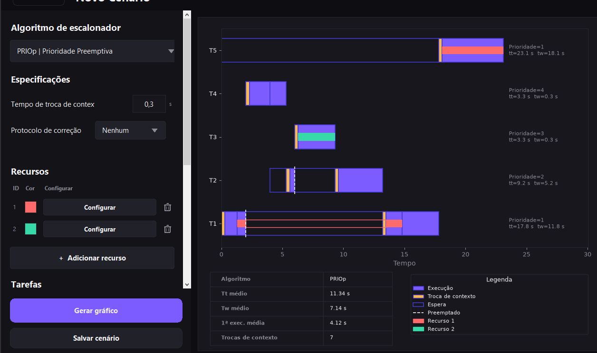

## 6. Recursos (PRIOp)

Com `PRIOp` selecionado, a seção **Recursos** aparece acima de Tarefas. Clique em **+ Adicionar recurso** para criar um recurso de uso exclusivo (`R1`, `R2`, ...) — cada um nasce com uma cor diferente, usada depois para colorir o diagrama de tempo.

Clique em **Configurar** na linha do recurso para abrir o popup de vínculos. Para cada tarefa que disputa aquele recurso, clique em **+ Adicionar vínculo** e preencha:

- **Tarefa** — qual tarefa disputa o recurso.
- **T.Ini (Recurso)** — depois de quanto tempo de *processamento próprio* da tarefa ela obtém o recurso.
- **T.Fim (Recurso)** — depois de quanto tempo de processamento próprio ela o solta.

> As colunas **T.Ini (Tarefa)** e **T.Fim (Tarefa)** só mostram, travadas, o início (sempre `0`) e a duração total da tarefa, como referência! 

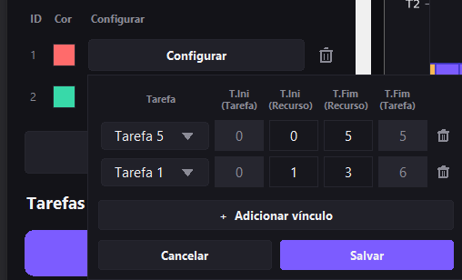

> O programa bloqueia um T.Ini menor que um T.Fim. Ele não proíbe o uso de um T.Fim maior que o T.Fim da tarefa (que não é destrutivo), mas emite um alerta.

Clique em **Salvar** para confirmar o vínculo, ou feche o popup clicando fora dele (o programa salva sozinho).

### Exemplo:
> A tarefa T1 (duração 6) obtém `R1` depois de 1s de execução própria e o mantém por 4s (`T.Ini=1`, `T.Fim=5`); a tarefa T4 (duração 3) obtém o mesmo `R1` depois de 1s e o mantém por 1s (`T.Ini=1`, `T.Fim=2`).

| Tarefa | Chegada | Duração | Prioridade | Recurso R1 |
|--------|---------|---------|------------|------------|
| T1 | 0 | 6 | 1 | obtém em 1s, solta em 5s |
| T2 | 4 | 4 | 2 | — |
| T3 | 6 | 3 | 3 | — |
| T4 | 2 | 3 | 4 | obtém em 1s, solta em 2s |

**Fica assim:**

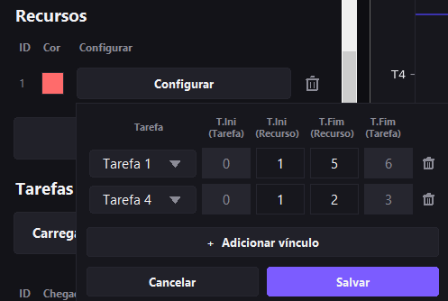

## 7. Gravar e recarregar um cenário

- **Salvar cenário** (fixo no rodapé da barra lateral) abre um diálogo para escolher onde salvar um arquivo `.json` com tudo o que está preenchido na tela — tarefas, recursos, algoritmo e parâmetros, mesmo os campos escondidos no momento (por exemplo, o quantum continua salvo mesmo se você estiver com FCFS selecionado).
- **Carregar cenário...**, na seção Tarefas, e **Abrir cenário...**, na tela inicial, abrem o mesmo diálogo para escolher um `.json` salvo anteriormente e preenchem a tela inteira a partir dele.

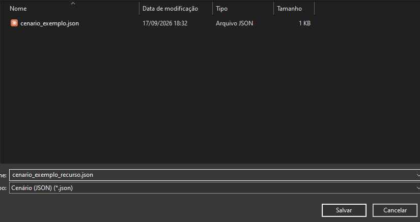

## 8. Conferir resultados conhecidos

Você pode testar os resultados padrões do `cenario_exemplo.json` em cada um dos algoritmos — é o cenário de referência do enunciado do projeto (Aula 5), o mesmo usado nos testes automatizados (`tests/test_*.py`):

| Tarefa | Chegada | Duração | Prioridade |
|--------|---------|---------|------------|
| T1 | 0 | 5 | 2 |
| T2 | 0 | 2 | 3 |
| T3 | 1 | 4 | 1 |
| T4 | 3 | 1 | 4 |
| T5 | 5 | 2 | 5 |

Resultados esperados pra esse cenário em cada algoritmo:

| Algoritmo | Parâmetros | Tt médio | Tw médio | 1ª exec. média | Trocas de contexto |
|:---------:|:----------:|:--------:|:--------:|:--------------:|:-------------------:|
| FCFS | `ttc = 0` | 8.0 s | 5.2 s | 5.2 s | 5 |
| FCFS | `ttc = 1` | 11.0 s | 8.2 s | 8.2 s | 5 |
| RR | `ttc = 0`, `quantum = 2` | 8.4 s | 5.6 s | 2.8 s | 8 |
| RR | `ttc = 1`, `quantum = 4` | 13.4 s | 10.6 s | 6.8 s | 7 |
| SJF | `ttc = 0` | 5.8 s | 3.0 s | 3.0 s | 5 |
| SJF | `ttc = 1` | 7.8 s | 5.0 s | 5.0 s | 5 |
| SRTF | `ttc = 0` | 5.4 s | 2.6 s | 2.4 s | 6 |
| SRTF | `ttc = 1` | 7.8 s | 5.0 s | 5.0 s | 5 |
| PRIOc | `ttc = 0` | 6.6 s | 3.8 s | 3.8 s | 5 |
| PRIOc | `ttc = 1` | 8.0 s | 5.2 s | 5.2 s | 5 |
| PRIOp | `ttc = 0` | 5.6 s | 2.8 s | 2.2 s | 7 |
| PRIOp | `ttc = 1` | 8.0 s | 5.2 s | 5.2 s | 5 |

**Para Recursos (PRIOp):**
Para testar os Recursos (Seção Crítica), e também para testar o input manual de tarefas, use esse cenário:
- Você pode **[baixá-lo aqui](https://github.com/andre-monar/escalonadores-python/releases/download/v1.0/cenario_exemplo_recurso.json)**
- Ou monte manualmente (retirado do enunciado do projeto) em `PRIOp`, protocolo **Nenhum**, `ttc = 0`:

| Tarefa | Chegada | Duração | Prioridade | Recurso R1 |
|--------|---------|---------|------------|------------|
| T1 | 0 | 6 | 1 | obtém em 1s, solta em 5s |
| T2 | 4 | 4 | 2 | — |
| T3 | 6 | 3 | 3 | — |
| T4 | 2 | 3 | 4 | obtém em 1s, solta em 2s |

> Lembre-se de criar o Recurso 1, conforme a seção 6

Ao clicar em **Gerar gráfico** com protocolo **Nenhum**, o resultado esperado é:

| Tt médio | Tw médio |
|:--------:|:--------:|
| 9.75 s | 5.75 s |

| Tarefa | T1 | T2 | T3 | T4 |
|:------:|:--:|:--:|:--:|:--:|
| Tw | 10 s | 3 s | 0 s | 10 s |

Repare que T4 tem a maior prioridade, mas ainda assim espera 10s por causa da inversão de prioridade: T2 e T3 preemptam T1 (que segura o recurso que T4 precisa) sem nunca disputar o recurso.

Trocando o protocolo de correção para **Herança** ou **Teto**, os dois resolvem essa inversão por caminhos diferentes, mas chegam no mesmo resultado:

| Tt médio | Tw médio |
|:--------:|:--------:|
| 9.50 s | 5.50 s |

| Tarefa | T1 | T2 | T3 | T4 |
|:------:|:--:|:--:|:--:|:--:|
| Tw | 10 s | 7 s | 2 s | 3 s |

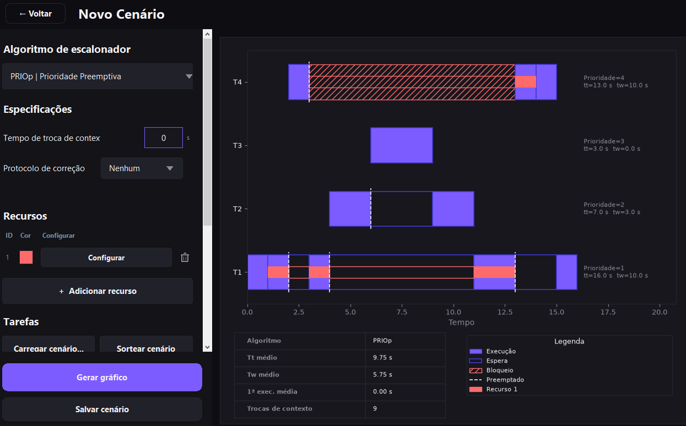

## 9. PRIOc com envelhecimento

O envelhecimento (fator `α`, seção 3) evita que uma tarefa de prioridade baixa espere pra sempre atrás de tarefas de prioridade mais alta: a cada segundo de espera, a prioridade efetiva dela sobe `α` (`prioridade_efetiva = prioridade_base + α × tempo_de_espera`).

Pra ver o efeito, **[baixe o cenário de exemplo clicando aqui](https://github.com/andre-monar/escalonadores-python/releases/download/v1.0/cenario_exemplo_envelhecimento.json)**, ou monte o cenário de inanição do enunciado (seção 4.6) em `PRIOc`, `ttc = 0`: T1 disputa com cinco tarefas de prioridade bem mais alta, que vão chegando de 2 em 2 segundos:

| Tarefa | Chegada | Duração | Prioridade |
|:------:|:-------:|:-------:|:----------:|
| T1 | 0 | 4 | 1 |
| T2 | 0 | 2 | 5 |
| T3 | 2 | 2 | 5 |
| T4 | 4 | 2 | 5 |
| T5 | 6 | 2 | 5 |
| T6 | 8 | 2 | 5 |

Com `α = 0` (sem envelhecimento), T1 só roda depois de **todas** as outras — é a inanição que o envelhecimento existe pra evitar:

| `α` | Tw de T1 | Tw médio |
|:---:|:--------:|:--------:|
| 0 | 10 s | 1.67 s |
| 1 | 4 s | 2.67 s |
| 2 | 2 s | 3.00 s |

Com `α = 1`, a prioridade efetiva de T1 cruza o valor 5 (a das outras) em `t = 4` (`1 + 1×4 = 5`), e ela passa na frente de T4/T5/T6. Com `α = 2` o cruzamento acontece ainda mais cedo (`t = 2`), e T1 passa na frente de T3 também.

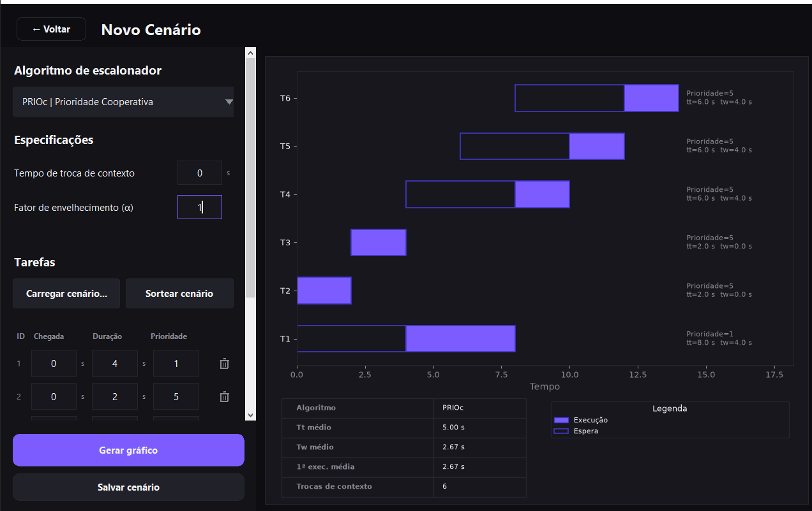

## 10. Rodar lote

Na tela inicial, clique em **Rodar lote**. O programa sorteia 50 cenários aleatórios (mesmo sorteio da seção 4) e roda os seis algoritmos em cada um deles, com `quantum = 2 s` e `ttc = 0 s` fixos. Ao final, abre um popup com a média de Tt, Tw e 1ª execução de cada algoritmo sobre os 50 cenários.

Como os cenários são sorteados, os números exatos mudam a cada clique — mas a tendência entre os algoritmos se mantém:

| Métrica | Tende a ser o menor | Tende a ser o maior |
|:-------:|:--------------------:|:--------------------:|
| Tt | SRTF | RR |
| Tw | SRTF | RR |
| 1ª exec. | RR | FCFS/PRIOc |

Feche o popup em **Fechar**.

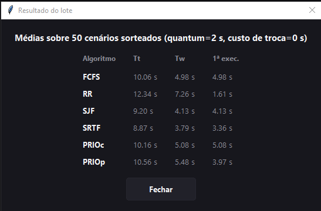

### Confira a documentação técnica em [Documentação do projeto](./documentacao_projeto.md)!